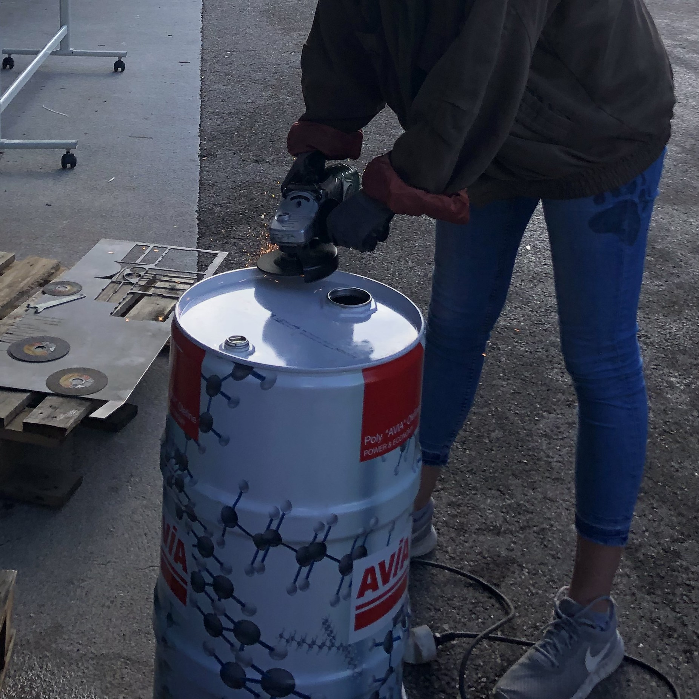
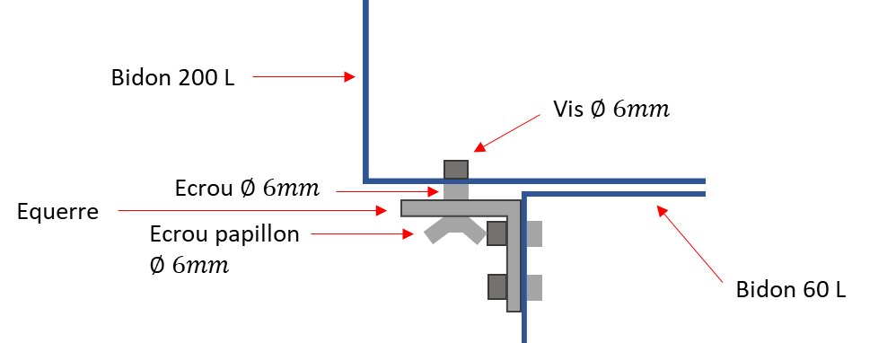
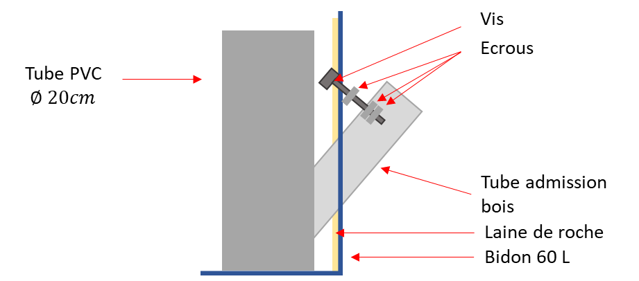
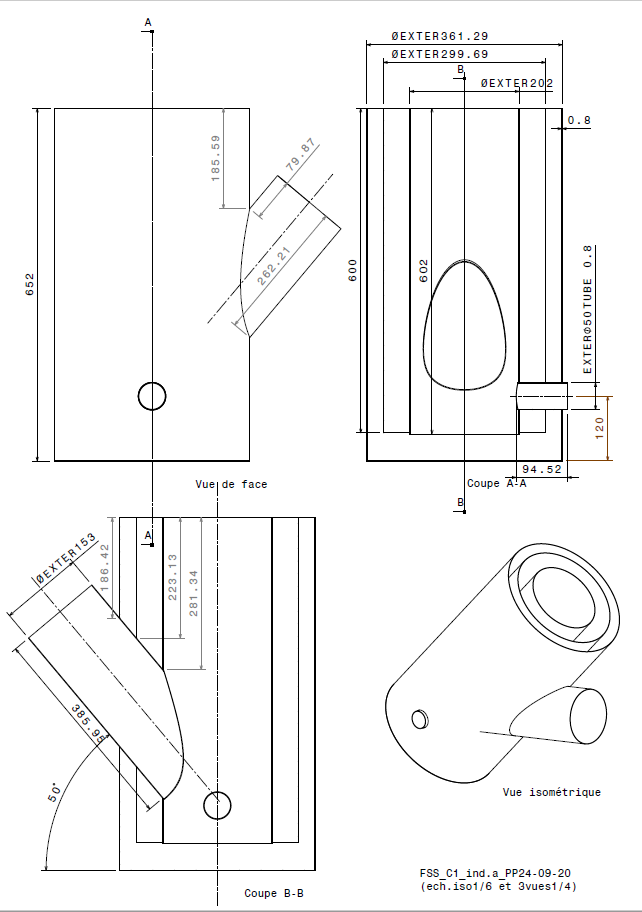

###### Tags: `PISTE` `PISTE2021` `Grenoble INP` `cuiseur oxalis`

---
*NB : Vous ne savez pas écrire en markdown ? Pas d\'inquiétudes ! Utilisez directement la barre d\'outil en haut à gauche pour mettre des titres, mettre en gras, insérer des liens - images, \...
Pour en savoir plus, voici [un tutoriel](https://blog.wax-o.com/2014/04/tutoriel-un-guide-pour-bien-commencer-avec-markdown/) et [une autre aide](hAttps://pad.lescommuns.org/apprendre_utiliser_pad#)*\

---

Pour éditer ce pad, vous devrez vous créer un compte *lescommuns.org* (la validation est immédiate)

---

# Cuiseur Oxalis - Fabrication brûleur

## Informations

* **résumé:** cuiseur à bois (pour environ 25 personnes)
* **difficulté:** moyen
* **durée:** 50 heures/personne
* **coût:** Sac 50L permiculite 30€ (\~0.60€/L)

*NB: 50 h/personne = 50 heure si on le fait seul, 25h à deux\...*

### Ressources

-   [Le site de l\'association Oxalis](http://www.oxalis-asso.org/?page_id=4866)
-   [Photos de la réalisation](https://drive.google.com/drive/folders/1fmUhOe4w6hyGFId1UPpFGXh2_6Fj59mG?usp=sharing)
-   [Le tutoriel disponible sur le site d\'Oxalis](http://www.oxalis-asso.org/?page_id=4866)

### Contributeur·ices

Louis Chateau, Laure Ferreira, Rémi Nus, Tugdual Le Nir, Marie
Marchesi-Hubo, Éléa Fortin, Yousra Tchorbo, Agathe Ménage, Rémy Le
Calloch, Hugo Jonvel

### Contenu

Une notice détaillée, des conseils, les infos scientifiques en annexes.

NB: si certaines étapes sont peu claires ou insuffisamment détaillées,
croiser ce tutoriel avec celui disponible sur le site d\'Oxalis (lien
plus haut)

### Idées d\'annexes et d\'améliorations

-   Ajouter plus de photos
-   Comparaison des matériaux isolants
-   Bilan carbone

## Matériel

### Pour les bidons

-   Cisaille à tôle
-   Meuleuse
    -   Disque de découpe (métal)
    -   Disque de meulage (métal)
-   Lime à métaux
-   Marteau à panne ronde (marteau de carrossier)
-   Pince multiprise
-   Perceuse et huile de coupe

### Pour le béton

-   Sceau de chantier
-   Truelle
-   De l\'huile de coude ;)

## Matériaux à préparer en amont

### Récupération

-   Bidon en acier de 60L d\'environ 36cm de diamètre et 65.5cm de
    hauteur *(récupérable gratuitement en garage, ce sont des bidons
    d\'huiles)*
-   Bidon en acier de 200L *(récupérable gratuitement en garage, ce sont
    des bidons d\'huiles)*

### En magasin de bricolage

-   50L de perlite/vermiculite
-   Sac de ciment fondu (5kg suffisent)
-   Tube aluminé de 125 mm de diamètre et de 1 m de hauteur (cheminée)
-   Tube coudée aluminée de 125 mm de diamètre (cheminée)
-   Tube aluminé de 150 mm de diamètre et de 50 cm de hauteur (admission
    bois)
-   Tuyau en PVC de 20cm de diamètre et d\'au moins 65cm de hauteur
-   Plaque de laine de roche de dimensions 3cmx100cmx60cm

### Visserie

-   2 poignées
-   4 ensemble vis + écrou (fixation des poignées au bidon)
-   3 équerres, 6 ensembles vis + écrou, 3 écrous papillons
-   1 vis longue + 2 à 3 écrous (fixation de l\'admission bois au bidon)
-   4 ou 5 rivets

## Fabrication

NB: certaines étapes peuvent être réalisées dans un ordre différent, ou
en parallèle. Le paramètre le plus important à considérer est le séchage
du béton (étapes 3 et 6).

### 1. Bidon inférieur

#### Principe

Préparation du bidon inférieur qui servira de chambre de combustion. Il
faut nettoyer, réaliser les différentes ouvertures et fixer des poignées
qui serviront au transport. Le bidon doit être propre pour éviter un
départ de feu avec les étincelles lors de la découpe à la meuleuse.

#### Préparation

-   nettoyer l\'exterieur des bidons avec un tissu mouillé.
-   rincer l\'interieur des bidons avec de l\'eau

*NB : Ne pas jeter le mélange huile-eau au tout-à-l\'égout. Le mettre
dans un contenu étanche destiné à la déchèterie. Un torchon ou de la
sciure peuvent être utilisés pour enlever les restes d\'huile.*

#### Réalisation

1.  Sommet du bidon : Le bidon est fermé par une taule de métal qui est
    repliée sur le reste du bidon. Il suffit donc de meuler la lèvre
    (dessus du périmètre exterieur du haut du bidon) jusqu\'à arriver à
    la taule latérale du bidon. Utiliser le disque à ébavurer,
    
    Une fois que ce périmètre est suffisamment ébavuré, il suffit de
    faire tomber le couvercle en tapant dessus à l\'aide d\'un marteau.

2.  Trou d\'arrivée d\'air : En se référant au plan fourni par Oxalis et
    ici en annexe, il faut créer une arrivée d\'air. C\'est un trou
    circulaire de 50mm de diamètre à 12 cm de hauteur à partir du bas du
    bidon et à 90° de l\'arrivée de bois que nous réaliserons juste
    après. Il est recommander de tracer le cercle au compas. Pour plus
    de conseils sur la découpe : se référer à la rubrique *conseil
    bricolage*

*NB : L\'ajout du trou d\'arrivée d\'air permet d\'augmenter la quantité
d\'air qui arrive jusqu\'au feu et ainsi aumgmenter la quatité de
comburant (cf. triangle de feu).*

3.  Trou du tuyau d\'alimentation en bois : La zone à percer n\'est pas
    circulaire car le tuyau d\'alimentation doit respecter un certain
    angle. Ainsi il faut se servir du [patron
    suivant](http://www.oxalis-asso.org/wp-content/uploads/De%CC%81coupe-bru%CC%82leur.pdf)
    pour la découpe.

Attention à bien imprimer au format A4 à échelle 1, sinon les découpes
ne correspondront pas. Placer le gabarit à 185mm du haut du bidon (cf
plan : le haut de l\'\"oeuf\" est à 185mm du haut du bidon). De plus, le
trou se trouve à 1/4 de tour (90°) du trou d\'arrivée d\'air. La découpe
se fait à la disqueuse ou à la cisaille. Essayer de faire la découpe la
plus propre possible (cf. bricolage)

4.  poignées

-   tordre les poignées pour épouser la forme du bidon. Pour se faire,
    fixez le centre de la poignée dans un étau et martelez avec
    délicatesse un des côtés de la poignée.

*NB: Éviter de marteler les ailettes ou de les coincer dans l\'étau
(risque de casse).*

-   Faire les 4 trous necessaires pour fixer les poignées. On se place à
    environ 20 cm du haut du bidon (souvent sur le premier bourrelet).
    Les poignées sont placées à 90° de l\'ouverture pour le tube
    d\'admission de bois.
    

### 2. Isolation en laine de roche

#### principe

L\'intérieur du bidon inférieur est tapissé de laine de roche pour
l\'isoler.

#### préparation

-   réaliser des entailles de 2cm de profondeur au cutter tous les 2cm
    dans le sens de la largeur du panneau de laine de roche pour pouvoir
    lui donner une forme tubulaire.

*NB : Les stries font toutes la largeur et vont bien d\'un côté à
l\'autre du panneau de laine. Le cutter est plus efficace que la lame de
scie.*

#### réalisation

*NB : attention à ce que votre bidon soit bien sec pour garder le
pouvoir isolant de la laine de roche*

-   positionner la laine à l\'intérieur du bidon avec les stries vers la
    paroie du bidon.

-   découper les ouvertures réalisée sur le bidon dans la laine de
    roche.
    

### 3. Fond en béton allégé

#### principe

Un fond de béton permet d\'isoler et de stabiliser la chambre de
combustion.

*NB: cette étape implique du séchage (au moins 6h). Planifier en
fonction (séchage pendant la nuit ou autres étapes en parallèle).*

#### préparation

-   réaliser des marques sur la laine de roche, à 5cm du fond du bidon,
    afin de couler la bonne quantité de béton.
-   préparation le béton : 1 dose de ciment pour 3 dose de granules de
    vermiculite. Ajouter de l\'eau jusqu\'à obtenir la texture souhaitée
    . Attention, plus il y a d\'eau plus long sera le temps de séchage.

#### réalisation

-   couler le béton jusqu\'à la marque (5cm de haut)
-   laisser sécher sur une zone horizontale.
    
    *NB: pendant le séchages, certaines étapes suivantes peuvent être
    faites ou amorcées, tant qu\'elles n\'impliquent pas de poser des
    choses sur le béton.*

### 4. Équerres

#### principe

Des équerres servent à maintenir en place le bidon supérieur. elles
doivent être placées avant de couler le béton. Le bidon supérieur devant
être retiré pour le transport, on les fixes dans le bidon inférieur.

#### préparation

-   percer (si nécessaire) les équerres au diamètre des vis. Prévoir 2
    vis (en diagonale) pour la partie en contact avec le bidon
    inférieur, une seule pour le bidon supérieur (voir schéma
    ci-dessus).
-   placer les 3 équerres de sorte qu\'elles soient équidistantes autour
    du bidon inférieur (environ 120° entre chaque équerre). De plus, il
    faut avoir le moins d\'espace possible entre le fond du bidon
    supérieur et le bidon inférieur. Cela évite une sortie de la fumée
    par cet espace.

*NB : penser à prendre en compte l\'épaisseur de l\'écrou qui se
trouvera entre le bidon de 200L et les équerres.*

#### réalisation

-   percer et fixer dans le bidon inférieur

NB: le perçage du bidon supérieur sera effectué plus tard, afin de bien
aligner la chambre de combustion.

-   arrondir les angles à la meuleuse pour éviter de se blesser à
    l\'usage

### 5. Tube d\'admission du bois

#### principe

un tube aluminé permet d\'ajouter le bois dans la chambre de combustion.
Celui-ci doit être positionné avant de couler le béton, et découper de
manière spécifique afin d\'épouser la forme de la chambre de combustion.
Afin de prévoir un potentiel remplacement du tube d\'admission, une vis
est ajouter pour relier le tube d\'amission au bidon. En effet, un
nouveau tube ne serait pas pris dans le béton et aurait donc besoin
d\'un point de fixation.

*Ci dessus schéma du montage avant de couler le béton*

#### préparation

-   découper le tube aluminé (150mm x 50 cm) en s\'aidant du [patron en
    gueule de
    loup](http://www.oxalis-asso.org/wp-content/uploads/De%CC%81coupe-tube-alimentation.pdf)
    imprimé sur une feuille A4.

-   Découper le tube de pvc dans la longueur (nommée encoche par la
    suite), puis re-scotcher cette entaille par l\'intérieure. Elle
    permettra de retirer plus facilement le tube après moulage.
    S\'assurer que la partie inférieure du tube PVC (qui va reposer sur
    le socle en béton) soit horizontale pour que la chambre de
    combustion soit verticale

-   réaliser 2 trous face à face sur la partie qui sera émergente du
    tube PVC, afin d\'y insérer une barre qui fera office de bras de
    levier et facilitera le retrait du tube de PVC lors du démoulage.

#### réalisation

-   placer le tube PVC de 20cm de diamètre au centre du bidon. Vérifier
    que la gueule de loup découpée au préalable s\'adapte parfaitement à
    la forme du tube en PVC. Sinon, utiliser un marteau à panne ronde
    pour déformer le trou d\'admission bois réalisé dans le bidon.
-   s\'il reste du jeu entre le tube d\'admission et le tube PVC,
    combler avec du gros scotch. On s\'assure ainsi que le béton ne
    coule pas entre les deux.

*NB: mettre le scotch depuis l\'intérieur du tube d\'admission afin
qu\'il ne soit pas pris entre le tube et le béton.*

-   Une fois le tube en position, percer le tube d\'admission et le
    bidon afin de fixer la vis. La tête de vis est entre le bidon et la
    laine de roche. Mettre 2 boulons à l\'intérieur du tube
    d\'admission.

*NB1 : penser à découper la vis à la bonne dimension pour qu\'elle ne
gène pas l\'entrée du bois dans le tube d\'admission. NB2 : penser à
bien serrer les 2 derniers boulons entre eux. On s\'assure ainsi qu\'ils
ne bougeront pas et qu\'ils resisteront aux vibrations crées par
l\'insertion des morceaux de bois.*

### 6. Isolation en béton allégé

#### principe

Placer le tube de pvc dans le bidon afin de servir de moule. Couler
ensuite du béton allégé autour de celui-ci. Laisser sécher puis retirer
le pvc.

*NB: cette étape implique du séchage (au moins 8h). Planifier en
fonction (séchage pendant la nuit ou autres étapes en parallèle).*

#### préparation

-   préparer le béton de la même façon qu\'à l\'étape 3
-   vérifier le placement du tube de PVC (bien centré et droit pour que
    la cheminée soit centrée et droite).
-   placer un tube de carton à l\'intérieur de l\'entrée d\'air (de même
    diamètre), et l\'enfoncer jusqu\'au tube de pvc.

NB: utiliser des planches ou plus simplement de la ficelle pour
maintenir le tube de pvc en position.

#### réalisation

-   couler le béton entre la laine de roche et le tube de pvc jusqu\'à
    recouvrir la laine de roche. (truelle)
-   Laisser le béton sécher (8h minimum).
-   retirer le tube en carton de l\'entrée d\'air
    

*NB: avec des chutes de métal issues des bidons, il est possible de
réaliser une gueule pour l\'entrée d\'air (pour masquer la laine de
roche). Une telle bouche a été réalisée mais sans véritable méthode de
fixation. On peut sûrement faire mieux.*

-   retirer le tube de pvc

*NB: Une méthode plutôt efficace : commencer à décoller le pvc du ciment
au niveau de l\'encoche. Insérer une longue tige en métal dans les trous
réalisés préalablement de part et d\'autre du tube PVC. Dans l\'idéal, 2
personnes poussent la tige en même temps et dans le même sens de
rotation afin de faire tourner le tube de PVC. Une fois qu\'il a tourné,
il s\'enlève très facilement.*

-   Laisser à nouveau sécher au moins 8h avant d\'allumer le cuiseur.

### 7. Bidon supérieur

#### principe

On ajoute un bidon de diamètre supérieur (bidon de 200L) sur le premier
bidon, afin de supporter la poêle et la cheminée.

#### préparation

-   Dans le bidon de 200L, découper à la meuleuse par exemple une cuve
    de 26 cm de haut (en gardant le fond ou le haut avec le couvercle et
    les bouchons).

-   Découper un cercle de 20cm de diamètre dans le fond du bidon (au
    centre). (cisaille à tôle)
    

-   Présenter le bidon supérieur sur le bidon inférieur (en alignant le
    trou précédent avec le chambre de combustion)

-   Marquer et percer les trous correspondants aux équerres

### 8. Cheminée

#### principe

La cheminée est formée de 2 sections: un coude et un tube. Le coude est
fixé sur le côté du bidon supérieur par des ailettes rivetées. Le tube
est simplement enchassé dans le coude.

#### préparation

-   découper dans le coude des ailettes de 3cm de long, espacées
    d\'environ 3cm.
-   découper dans le bidon supérieur un trou de la forme de l\'entrée du
    coude (en enlevant 3cm de rayon pour les ailettes).
-   découper les ailettes dans le bidon.

#### réalisation

-   connecter le coude et le bidon, en repliant toutes les ailettes
    (celles du coude et celles du bidon) **à l\'intérieur** du bidon.
    Replier les ailettes contre le bidon (marteau à panne ronde et
    pince).

*NB : Placer la partie ondulée du coude dans le gros bidon. Cette partie
là ne doit pas se retrouver vers le haut sinon des cendres pourraient
s\'y coincer.*

-   percer 4 trous dans les ailettes (répartis autour du trou), et fixer
    un rivet dans chaque.
-   poser le tube de la cheminée dans la sortie du coude.
    

### 9. Poêle

#### principe

Afin de s\'assurer que la fumée s\'échappe par la cheminée, on cherche à
poser la poêle de la manière la plus hermétique possible sur le bidon
supérieur. On réalise donc des encoches pour les poignées de la poêle.

#### réalisation

-   découper 4 encoches sur le bidon supérieur pour accueillir les
    poignées de la poêle (à la pince ou à la meuleuse)

NB: penser à arrondir les angles à la meuleuse pour éviter de se couper
à l\'usage.

### 10. Fin !

-   bien laisser sécher le béton avant la première utilisation
-   utiliser une première fois \"à vide\" (en faisant chauffer de l\'eau
    par exemple) pour permettre aux résidus divers (huile, peinture) de
    brûler
-   vérifier et corriger d\'éventuelles sorties de fumée autres que par
    la cheminée

## Conseils bricolage

Pour percer un trou dans un bidon en métal :

-   Scie cloche
-   Cisaille + ailettes
-   Perceuse
-   Huile de coupe
-   Forets à métal

Pour réaliser un trou de petite dimension dans du métal il faut utiliser
une perceuse avec une mèche à métal. Le metal se perse par arrachement
de matière, il faut donc éviter de faire chauffer le métal et la mèche.
Il faut donc utilser la perceuse avec une faible vitesse de rotation et
utiliser de l\'huile de coupe pour lubrifier.

Pour réaliser une ouverture dans une plaque de métal il faut utiliser
une cisaille à tôle. Réaliser une ouverture précise peu s\'avérer
complexe ; pour cela on applique la méthode d\'ouverture par aillettes.

1.  Tracer le cercle correspondant a l\'ouverture souhaitée (cercle de
    pliure)

2.  Tracer un cercle de diamètre inferieur (cercle de découpe) et des
    ailettes.
    

3.  Découper à l\'aide de la cisaille à tôle le cercle de découpe et
    découper les ailettes

5.  A l\'aide de la pince multiprise, pliez les ailettes au niveau du
    cercle de pliure.
6.  Avec le marteau à panne ronde, ajustez l\'ouverture.

## Fonctionnement (partie théorie)

    Rocket-stove :

En fonction de l\'application, la conception sera différente. Pour une
utilisation en cuisine, on cherche à avoir de la chaleur localisée,
contrairement au chauffage ou la combustion doit être lente et la
chaleur doit être inertielle.

La combustion repose sur 3 paramètres :

-   Le temps
-   La température
-   Les turbulences

NB : Il est préférable d\'utiliser des sections rondes car elles
favorisent les turbulences (propagation des gaz par mouvements
circulaires).

La combustion est une réaction chimique qui à besoin de trois éléments :

-   La chaleur (dégagée par le feu)
-   Le combustible (gaz de bois dégagé par le bois chauffé)
-   Le comburant (oxygène contenu dans l\'air) =\> Schéma du triangle ?

NB : Plus il y a de chaleur, plus il y a de gaz de bois dégagé et
meilleure est la combustion.

Il existe 2 types de foyer pour la combustion : le foyer ouvert et le
foyer fermé. Le cuiseur Oxalis fonctionne avec un foyer fermé, ce qui
permet d\'avoir de meilleures performances.

## Usage

### Comment allumer le cuiseur ?

Quelle quantité de bois utiliser ? Comment vider les cendres ?

## Annexes

### Plan général

### Comparaison des matériaux isolants

### Bilan carbone de ce brûleur

------------------------------------------------------------------------

*Document sous licence [CC-BY-SA
4.0](https://creativecommons.org/licenses/by-sa/4.0/deed.fr)* 
